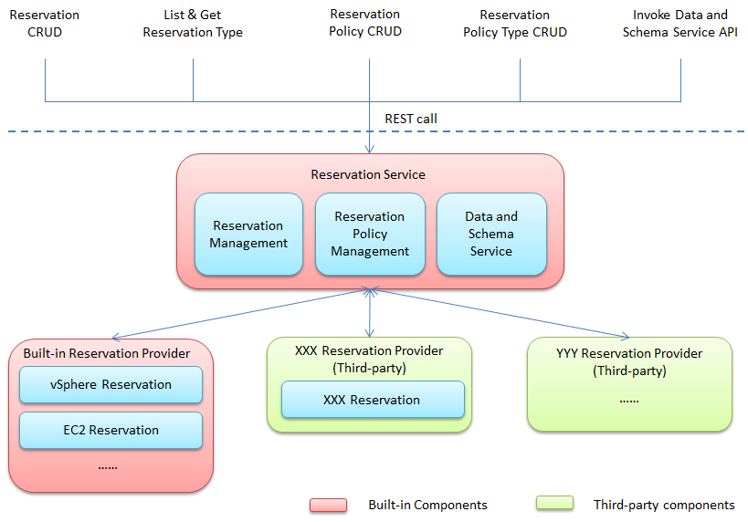
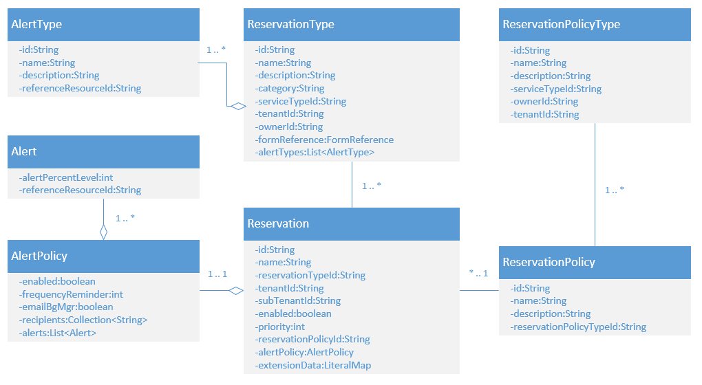

# Reservation Service

You can use the Reservation Service to manage reservations.

A reservation is a pool of resources for provisioning, consisting of several different types of resources. For example, a virtual reservation allocates a share of the memory, CPU and storage resources on a particular compute resource for a business group to use.

A reservation must belong to a business group, and a business group could have multiple reservations on the same resources or different resources.

You can use this generic Reservation Service for any artifact from any provider. For example, a service which follows its own provider-specified behaviors. The Reservation Service is extensible and you can add new types of reservations from third-party providers by using the Reservation Provider component.

## High Level View

The Reservation Service contains two parts following vRealize Automation's architecture:

1.  Reservation Service
2.  Reservation Provider

Reservation Service faces consumers directly to provide all reservation-related functionalities.

Reservation Provider registers the reservation and reservation policy types to Reservation Service, and handles all reservation-related requests. It is not exposed to consumers directly.

There might be one or more reservation providers and each reservation provider could register one or more reservation/reservation policy types to the Reservation Service.

Following sections provide more details about Reservation Service and Reservation Provider.

### Reservation Service

The Reservation Service is one typical component of vRealize Automation, which defines particular domain entities, registers Data and Schema Service endpoint, and provides corresponding API sets:

1.  Domain Entities

    1.  Reservation
    2.  ReservationType
    3.  ReservationPolicy
    4.  ReservationPolicyType
    5.  AlertPolicy
    6.  Alert
    7.  AlertType

2.  Registered Endpoints

    1.  Data and Schema Service

3.  Defined Endpoints

    1.  Reservation Callback

4.  API Sets

    1.  Reservation Type Management API
    2.  Reservation Management API
    3.  Reservation Policy Type Management API
    4.  Reservation Policy Management API
    5.  Data and Schema Service API

#### Domain Entities

Here is a diagram of reservation domain entities:

Reservation Service defines only the basic fields for the _Reservation_ entity, and Reservation Providers define the _ReservationType_, _AlertType_ and _ReservationPolicyType_. The _ReservationType_s provided by Reservation Providers defines the extensions for the _Reservation_, all those extension data are put into _extensionData_ field in _Reservation_.

You can use Data and Schema Service API to get the schema for the _extensionData_ by reservation type ID, and query the permissible values for particular fields declared in the schema if the fields support permissible values through the Data and Schema Service API.

### Reservation Provider

Reservation Providers are provided by Service Provider, and are used to handle all reservation-related requests, including:

1.  Register Reservation Types.
2.  Register Reservation Policy Types.
3.  Provide Reservation Callback implementation to manage all types of Reservation/Reservation Policy that were registered by it.
4.  Provide Data and Schema Callback implementation for schema and permissible value query.

### Sample Flows

Here is the simple sample flows about how to use Reservation Service, it lists only the API names needed for the flow rather than the full request/response, please refer to _vRealize Automation API Programming Guide_ for more details.

#### Create a Reservation

1.  Query available reservation types.

The following API call returns available reservation types:

`GET /reservation-service/api/reservations/types`

2.  Set value to the fields defined in the _Reservation_ entity (do not include _extensionData_ field).

It may to need to get the sub tenant ID by using the following API call:

`GET /identity/api/tenants/$tenantId/subtenants`

3.  Put the data into _extensionData_ field in _Reservation_ entity.

    1.  Query the schema definition by reservation type ID.

The following API call returns the schema definition for the specified reservation type:

`GET /reservation-service/api/data-service/schema/$reservationTypeId/default`

    2.  Put the data into _extensionData_ field in _Reservation_ entity based on the schema retrieved in previous step.

You may need to call the Data and Schema service to get the permissible values for the fields defined in schema:

`POST /reservation-service/api/data-service/schema/$reservationTypeIdOrSchemaId/default/$fieldId/values`

4.  Create the _Reservation_.

The following API call is used to create the target _Reservation_

`POST /reservation-service/api/reservations`

#### Register a Reservation Type

1.  Register the Reservation Provider to vRealize Automation.
2.  Register the i18n properties file for target reservation type to vRealize Automation.
3.  Register the Reservation Provider to the following endpoints:
    1.  com.vmware.csp.core.cafe.data
    2.  com.vmware.vcac.core.cafe.reservation-callback.provider
4.  Construct and register the _ReservationType_:

`POST /reservation-service/api/reservations/types`

#### Testing full relative path

Here is a full path in the repo to the terminator on a bike:

